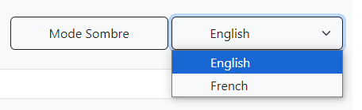
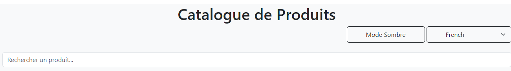
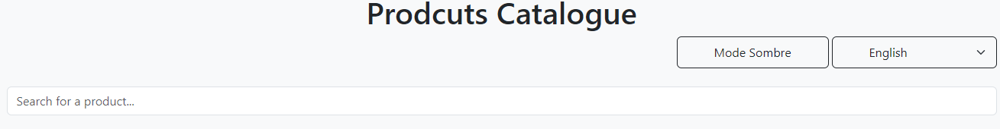
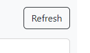
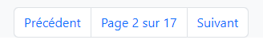

# TP React Hooks - Application de Gestion de Produits

Ce TP a pour objectif de mettre en pratique l'utilisation des Hooks React (useState, useEffect, useContext) ainsi que la création de Hooks personnalisés.

## Installation et configuration initiale

1. Cloner le dépôt :
```bash
git clone https://github.com/pr-daaif/tp-react-hooks.git
cd tp-react-hooks
```

2. Créer votre propre dépôt sur Github et changer le remote :
```bash
# Supprimer le remote origine
git remote remove origin

# Ajouter votre nouveau remote
git remote add origin https://github.com/[votre-username]/tp-react-hooks.git

# Premier push
git push -u origin main
```

3. Installer les dépendances :
```bash
npm install
```

4. Lancer l'application :
```bash
npm start
```

## Instructions pour le TP

Pour chaque exercice :
1. Lisez attentivement l'énoncé
2. Implémentez la solution
3. Testez votre implémentation (pensez à faire des copies d'écran)
4. Mettez à jour la section correspondante dans ce README avec :
   - Une brève explication de votre solution
   - Des captures d'écran montrant le fonctionnement
   - Les difficultés rencontrées et comment vous les avez résolues
5. Commitez vos changements avec un message descriptif

### Exercice 1 : État et Effets 
#### Objectif : Implémenter une recherche en temps réel

- [ ] 1.1 Modifier le composant ProductSearch pour utiliser la recherche
- [ ] 1.2 Implémenter le debounce sur la recherche
- [ ] 1.3 Documenter votre solution ici

_Votre réponse pour l'exercice 1 :_
```
Le hook useDebounce est créé pour éviter les requêtes inutiles lorsque l'utilisateur tape. Le hook définit la debouncedValue uniquement après un délai de 1000ms qui représente le délai, il retourne cette debouncedValue qui sera utilisée par notre composant. Ce "debounce" est un moyen d'améliorer les performances et de ne rechercher que lorsque l'utilisateur a arrêté de taper pendant un certain temps.
```
- Implementation de useDebounce :
```javascript
import { useState, useEffect } from 'react';

function useDebounce(value, delay) {
  const [debouncedValue, setDebouncedValue] = useState(value);

  useEffect(() => {
    const handler = setTimeout(() => {
      setDebouncedValue(value);
    }, delay);

    return () => {
      clearTimeout(handler);
    };
  }, [value, delay]);

  return debouncedValue;
}

export default useDebounce;
```
- Test de useDebounce :
```javascript
const debouncedSerachTerm = useDebounce(searchTerm, 1000);

  useEffect(()=>{
    console.log(debouncedSerachTerm)
  },[debouncedSerachTerm])
```


### Exercice 2 : Context et Internationalisation
#### Objectif : Gérer les préférences de langue

- [ ] 2.1 Créer le LanguageContext
- [ ] 2.2 Ajouter le sélecteur de langue
- [ ] 2.3 Documenter votre solution ici

_Votre réponse pour l'exercice 2 :_
```
Explication :

    - Nous avons ajouté une balise select avec les options fr et en à notre composant.
    - Nous contrôlons la valeur sélectionnée à l'aide de l'état language.
    - La langue sélectionnée est mise à jour à chaque changement du composant select.

2.1 Le LanguageContext est créé pour partager l'état de la langue dans notre application. Cela nous permet de mettre en œuvre la fonctionnalité d'internationalisation dans tous les composants que nous souhaitons.

2.2 Nous avons ajouté un élément select à l'intérieur de App.js pour permettre à l'utilisateur de changer la langue de l'application. Il utilise l'état language pour contrôler la valeur sélectionnée et setLanguage pour mettre à jour la langue à chaque changement.    

Difficultés rencontrées :

    La partie la plus difficile a été de comprendre l'ordre des composants afin de m'assurer que tous les composants ont accès au LanguageContext. J'ai corrigé cela en m'assurant que le fournisseur se trouve en haut de l'arborescence des composants.
```
- Sélecteur de langue



- Sélecteur pendant le changement :
   * Option de Francais
 
   * Option d'Englais
 

### Exercice 3 : Hooks Personnalisés
#### Objectif : Créer des hooks réutilisables

- [ ] 3.1 Créer le hook useDebounce
- [ ] 3.2 Créer le hook useLocalStorage
- [ ] 3.3 Documenter votre solution ici

_Votre réponse pour l'exercice 3 :_
```
Explication :
   - Ce hook prend une key et une initialValue comme entrées.

   - Il tente de récupérer la valeur du stockage local en utilisant la clé, en revenant à initialValue si elle n'est pas trouvée.

   - useEffect est utilisé pour mettre à jour le localStorage chaque fois que storedValue change.

3.1 Le hook useDebounce est déjà créé dans l'exercice 1.2.

3.2 Le hook useLocalStorage est créé pour abstraire la logique de définition et d'obtention des données depuis le stockage local. Il utilise localStorage pour stocker et récupérer les données pour une key donnée et il utilise une initialValue lorsque la valeur n'est pas trouvée.

Difficultés rencontrées :

   * La partie la plus difficile a été de m'assurer que les valeurs sont correctement converties en chaînes et analysées dans le hook useLocalStorage.
```

### Exercice 4 : Gestion Asynchrone et Pagination
#### Objectif : Gérer le chargement et la pagination

- [ ] 4.1 Ajouter le bouton de rechargement
- [ ] 4.2 Implémenter la pagination
- [ ] 4.3 Documenter votre solution ici

_Votre réponse pour l'exercice 4 :_
```
4.1 Nous avons ajouté un bouton pour déclencher une nouvelle récupération des produits dans le composant ProductList. Nous avons créé une fonction reloadProducts dans le useProductSearch qui effectue une nouvelle récupération.

4.2 Nous avons mis en œuvre la pagination en utilisant les états currentPage et totalPages. Nous avons également ajouté une logique aux boutons pour augmenter ou diminuer la page actuelle. La pagination est mise à jour à l'aide du hook useEffect.

Difficultés rencontrées :

La partie la plus difficile a été de calculer correctement le nombre total de pages et de mettre à jour le currentPage correctement sans effectuer d'appels infinis.
```
* Bouton de rechargement



* Pagination




## Rendu

- Ajoutez l'URL de votre dépôt Github dans  **Classroom** et envoyer la réponse dès le démarage de votre projet.
- Les push doivent se faire au fûr et à mesure que vous avancez dans votre projet.
- Le README.md doit être à jour avec vos réponses et captures d'écran. 
- Chaques exercice doit faire l'objet d'au moins un commit avec un message mentionnant le numéro de l'exercice.